# Using ArcGIS Desktop, ArcGIS.com and Collector 

This session will explore using ArcGIS, ArcGIS Online and Collector for ArcGIS to create an integrated spatial data collection system. This tutorial will explore the entire workflow, from preparing the project geodatabase in ArcGIS for Desktop, to deploying the resulting application in ArcGIS Collector and managing offline editing workflows. Our objective will be to deploy an application for the survey of trees, but the workfows and methods we use can be applied to nearly any data collection project. 

## Using ArcGIS Desktop and ArcGIS Online for Mobile Data Collection with Collector for ArcGIS

In this excercise, we will create a field data application for the collection of data on the interaction between large African predator species and livestock and other prey. Some of the pre-existing data we will use for the excercise was obtained from the following study of large predator behaviour at the Lewa Wildlife Conservancies near Isiolo, Kenya. 

[Dupuis-Desormeaux M, Davidson Z, Mwololo M, Kisio E, Taylor S, MacDonald SE (2015) Testing the Prey-Trap Hypothesis at Two Wildlife Conservancies in Kenya. PLoS ONE 10(10): e0139537. doi:10.1371/journal.pone.0139537](http://journals.plos.org/plosone/article?id=10.1371/journal.pone.0139537)

### Preparing your data in ArcGIS for Desktop

The first step in the process will be to prepare the geodatabase that will drive our data collection application, in ArcGIS Desktop. Eventually, this geodatabase will be uploaded to ArcGIS.com for the creation of our data collection application, but much of the "data carpentry" we need to do is best performed locally, on ArcGIS Desktop. 

#### Create your geodatabase

Geodatabases organize and store data you collect. Ultimately you'll create a feature class to store damage assessment reports, but first you need to create the geodatabase that holds the feature class. Take the following steps to create a file geodatabase by using the Catalog window in ArcMap.

1.  Start ArcMap, save your Map Document as PredationSurvey.mxd, in your project folder, and open the Catalog window.
2.  Right-click the file folder in the Catalog tree where you want to create the file geodatabase.
Point to New.
3.  Click File Geodatabase to create a new file geodatabase in the location you selected. Name your geodatabase **PredationSurvey**.
4. Right-click on your new geodatbase and select **Make Default Geodatabase**.

### Create and Define geodatabase domains

Some fields in your data should be populated from a set of choices. By creating domains in your geodatabase, you provide a list of choices your users can choose from when they are collecting data. This provides several advantages, including the enforcement of controlled vocabularies in your data collection, data collection speed, etc... 

In this excercise, we will create our Domains from a preexisting dataset. This dataset was collected during a study of large carnivore/livestock interactions in Kenya. The first thing we want to do is examine the data, and then collapse the fields we want to create domains for into "unique values."

Domains are created at the Geodatabase level, rather than the layer level, since in some cases (True/False, Percentages, etc...) it might be possible to use a Domain for more than one layer and field.

1. Right-click on your new geodatabase and select Import>Table>Single
2. Browse to the **Data** folder, find the PREDATION.xls file, click on the + sign to expand and reveal the WOrksheet inside this Excel File. 
3. Select the predation$ worksheet as the input table, use the same name for the output table, and click OK to import the table.

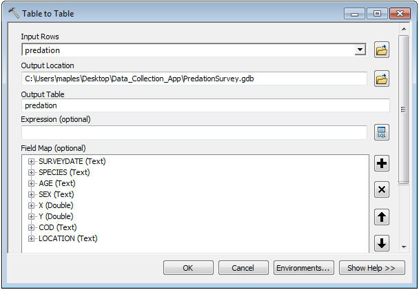
3. When the import has completed, drag the new geodatabase table into your Data Frame or Table of Contents and Open it to examine the data.

Examine the available fields and note that several of the field have data values that repeat many times. These fields make excellent candidates for fields driven by domains in our resulting app. These fields include: Species; Age, Sex, and COD (Cause of Death). 

We will use the Summarize function to create tables for our domains.

1. Right-click on the Field Header for the SPECIES field in the PREDATION table and select Summarize.

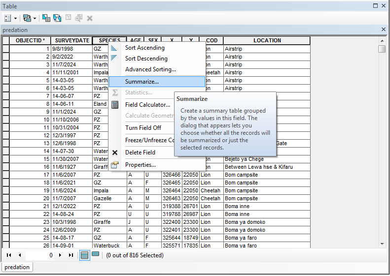

2. Double check that the Output Table is being sent to your PredationSurvey.gdb and name the output **species** and click OK.

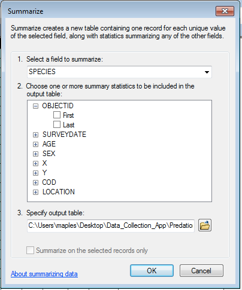

3. Select Yes, when prompted to add the table to the document and then Open the new table to examine it's contents

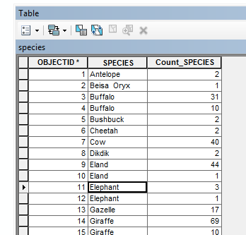

### Cleaning Up the Data
Note that there are several duplicates in the results table, which is a result of several different spellings, extra spaces, capitalization, etc... this is exactly what we would like to avoid by using domains in our Collector App. Now, we'll quickly clean the table up before we import it as a domain for our GDB.

1. Right-click on the species table in the ToC and select Edit Features>Start Editing
2. Note that our first duplicate value is 'Buffalo,' though it is not apparent why these values are not the same. If you double-click in the first 'Buffalo' cell, then on the next, you can see that the second cell actually contains an extra space, after the word 'Buffalo'.
3. Click on the small grey box at the far left of the second 'Buffalo' value to select that row, then click on the Delete Feature button at the top of the table to delete this row. 

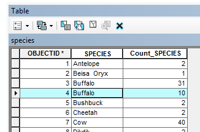

1. Now, continue down the table and examine duplicate values, deleting those values that have capitalization issues, spaces, misspellings, etc..., and repairing values that need capitalization or spelling correction. Your table should look something like that, below, when you are done. 

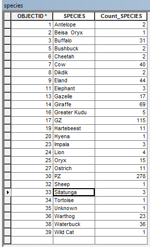

2.  On the Editor Toolbar, select Editor>Stop Editing and select **Yes** when prompted to save your edits.

Repeat the above step for the **AGE**, and **COD** fields, we will enter the damin values for **SEX** manually, so we don't need to create tables for that.

Note: It might be useful to change the values in AGE field to 'Juvenile', 'Sub-Adult', 'Adult', 'Unknown'

### Manually Entering Domain Values into the Geodatabase

1. In the Catalog tree, right-click the PredationSurvey Geodatabase and click Properties.
2. Click the Domains tab.
3. Click the first empty field under Domain Name and type **sex** for the new domain.
4. Press the Tab key or click the new domain's description field, and type a description for the domain.
``Tip:
When creating a new domain, specify a name that describes the parameter it governs. The description is a small sentence describing the purpose of the domain.
``  
5. Click the field next to Domain Type, click the drop-down arrow, click Coded Values from the list of domain types, and choose Text as the Field Type.
6. Click the first empty field under Coded values and type **Unknown** for the first valid code.
``
Tip:
When entering coded values, make sure the code field matches the Field Type specified in the Domain Properties.
``
7. Press the Tab key or click the new coded value's Description field. Type **Unknown** as the user-friendly description for this coded value.
8. Repeat the previous 2 steps until all valid values and their descriptions have been typed. The result should be something like this:

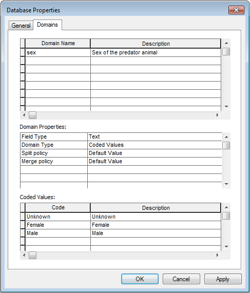

9. Click OK to create the new domain in the geodatabase and close the dialog box.

### Importing a Domain to the Geodatabase from a Table

Sometimes, you might want to create a Domain with so many values that it is not practical, or at least convenient, to enter them manually. You can also create domains by importing tables, which is why we prepared domain tables for the **SPECIES**, **AGE** and **COD** fields.

1. Bring the **Search** Panel up (**Windows>Search**), and enter '**domain**' as your search term.
2. In the search results, find the Table to Domain tool and click on it's title to open the ArcToolbox Tool.
3. Use the following parameter values for the Table to Domain tool:

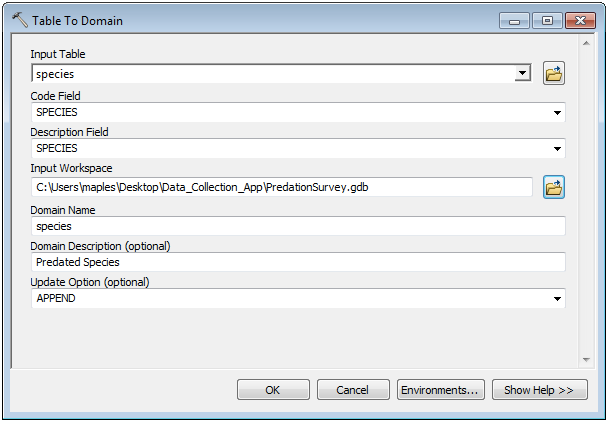

3. Click OK to create the Domain
4. WHen the tool is finished, open the properties of your geodatabase and check that the new domain was created:

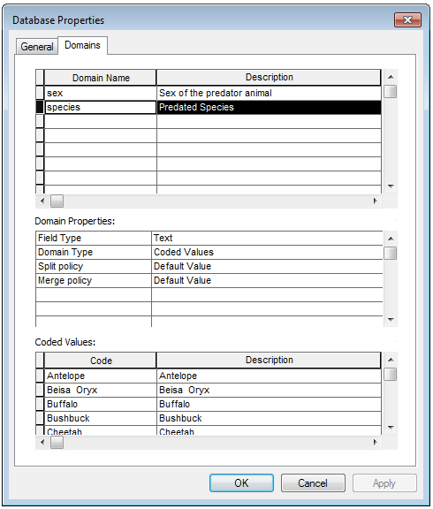

Repeat the Table to Domain method to import the remaining Domains (AGE and COD), as below:

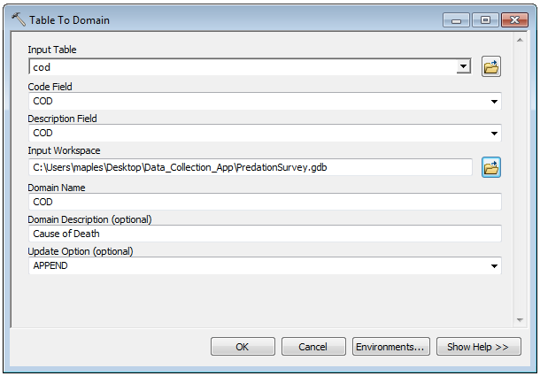

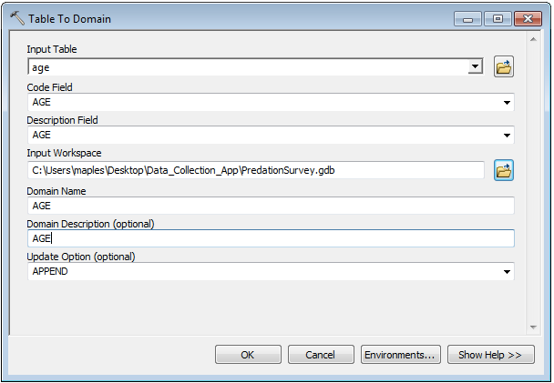

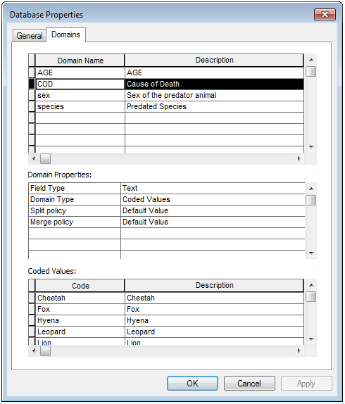

### Create the Feature Class to Contain Your Data

Now, you'll create the feature class to hold the collected information. Feature classes are essentially containers for information, where the pieces of information share similar characteristics, whether that be their geometry or their attributes.

1. Right-click the geodatabase and select **New>Feature Class**.
2. Name your **New Feature Class** '**PredationEvents**' and give it an Alias of '**Predation Events**' (with a space).
3. Change the Type to '**Point Features**' and click Next>.

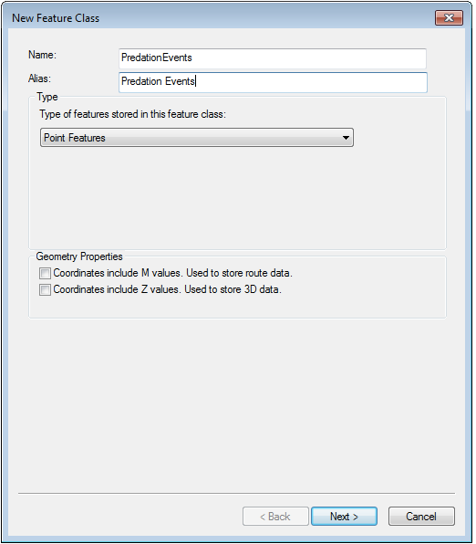

4. In the Coordinate System panel, browse to **Geographic Coordinate System>World>WGS 1984**, select it and click **Next>**.

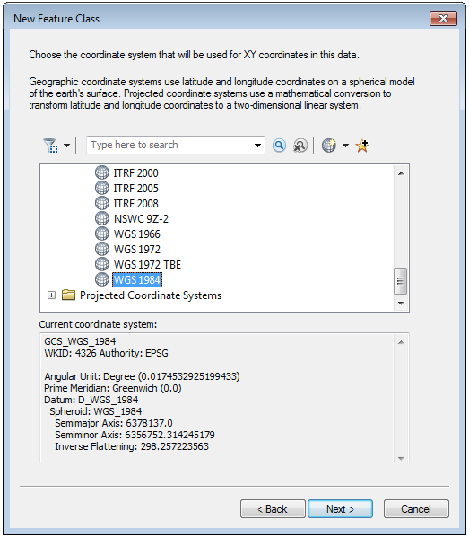

5. Click **Next>** for both the **XY Tolerance** and Screenshot 2017-02-07 17.14.05.png panels
6. In the Field Name panel, enter your Field Names and Data Types as below. As you create your Fields, note that in the Field Properties panel at the bottom, you can assign the appropriate Domains to the fields as you create them. Click FInish to create your Feature Class when you are done.

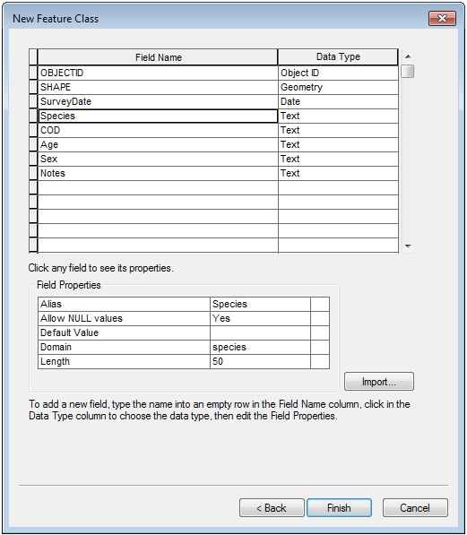

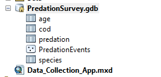

7. Right-click on the new PredationEvents feature class in your geodatabase, select Properties and click on the Fields tab. 
8. Note that you can assign Domains in this Properties>Fields tab, even after the feature class has been created.

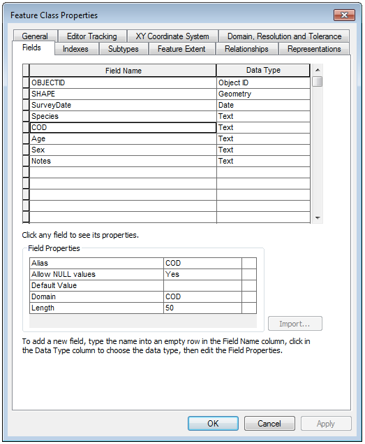

Note: Through the **Feature Class Properties>Fields** tab, you can add additional fields (with or without domains) to complete your data model.

### Create Symbology/Editing Templates

Even though we've no data in our feature class, yet, we DO have a domain assigned to the field that we will want to symbolize and organize our data collection around, COD.

Note that when you created your new feature class, it was automatically added to the Table of Contents, in ArcMap. Now we will use normal workflows for symbology to apply styles to the dataset, in ArcMap. Once we have our Mobile App created, the styles we create, now, will determine how our Editing Template in Collector will appear. 

1. Right-click on the 'Predation Events' layer, in the Table of COntents, and select Properties.
1. Click the Symbology tab.
2. Click the Categories section under the Symbology tab and choose Unique values.
3. In the Value Field drop-down list, choose the **COD** field and click Add All Values.
4. Right-click the first value in the list and click Properties for All Symbols.
5. In the Symbol Selector, select a symbol of your choice (set it's size to 10) and click OK.
6. Double-click each house icon, and choose a different color for each of the COD symbols.
7. Click Apply and click OK. The symbols should update in the table of contents. Note that you can also right-click on each symbol in the Table of Contents and change it's color.

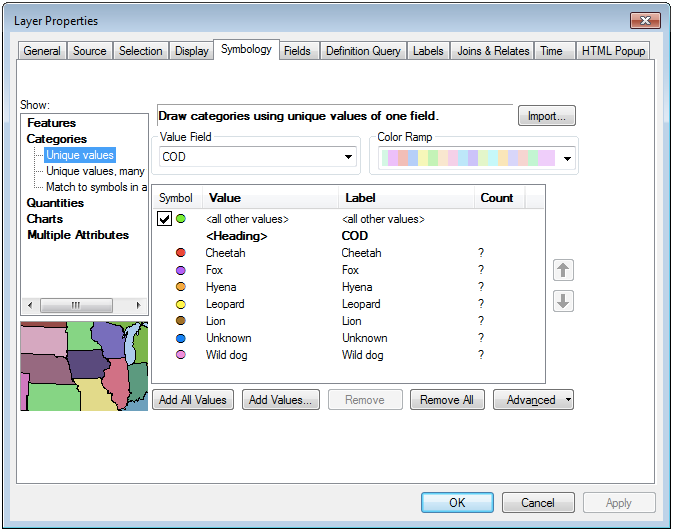

8. Save your work

### Enabling Attachments in Collector

One of the most powerful features in Collector for ArcGIS is the ability to attach photographs to records in the database. This means that data that can be captured in a photograph can be quickly captured using the device's camera, and transcribed into databases at later dates. An example might be for a bike rack survey, in which the style, capacity, condition, etc... can mostly be captured in a single image.

To have the ability to add photos to our survey application, we need to take one simple step before publishing our geodatabase to ArcGIS.com. 

1. Browse to your PredationSurvey geodatabase in the ArcCatalog Panel.
2. Expand the geodatabase to view the object inside it, right-click on the PredationEvents featuer class we just created and select **Manage>Create Attachements**.
3. If successful, you should see a new table called **PredationEvents_ATTACH**, as well as a new Relationship Class, called **PredationEvents_ATTACHREL** 

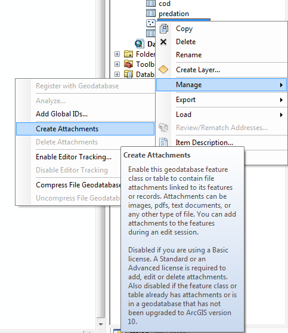

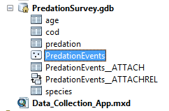

### Publish your data

We now need to make our data avaialble to the Collector for ArcGIS application on the internet. This can be done through ArcGIS for Server or to an ArcGIS.com organization. In this tutorial, you'll publish the service to your ArcGIS organization, where it will be available as a layer that you can add to, not only to the map that drives your data collection app in Collector, but to other, public facing maps, that will visualize your data as it is collected.

1. If you're not already signed in to your ArcGIS organization in ArcGIS for Desktop, sign in by going to **File>Sign In...** and follwowing the prompts.
2. Go to **File>Share As**, and click **Service**.

3. On the Share as Service panel, confirm the option **Publish a service** is selected. Click Next.

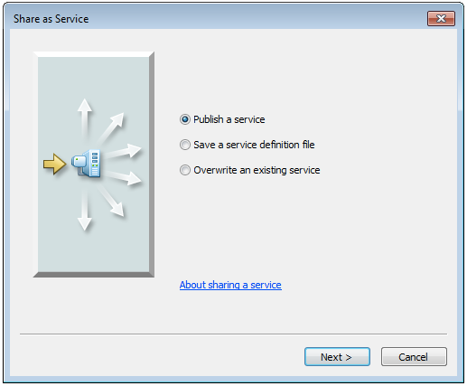

4. On the Publish a Service panel, expand the Choose a connection drop-down list and select **My Hosted Services (your organization name)**.
6. Use **PredationSurvey** as the service name and click Continue.

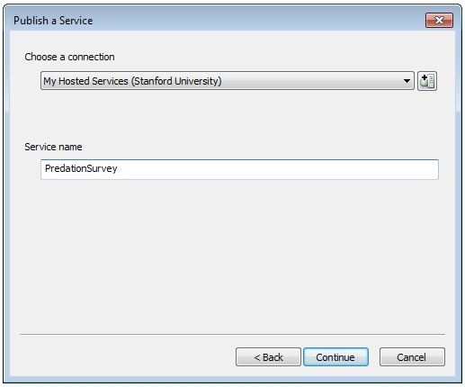

7. In the left pane on the Service Editor window, click **Capabilities**.

8. In the right pane, ensure that the Feature Access box is checked, and that the Tiled Mapping box is unchecked. This specifies that you'll publish a feature service rather than a tiled map service.

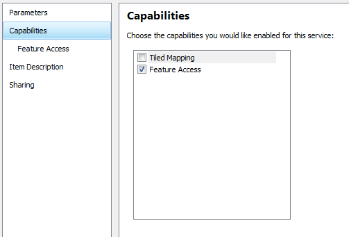

10. Under Feature Access, check Create, Delete, Sync, and Update. 

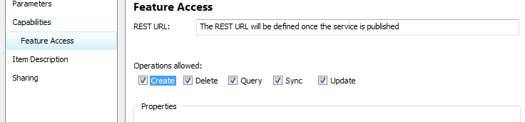

11. In the left pane, click Item Description.
12. Add Data tags & Summary and Description.

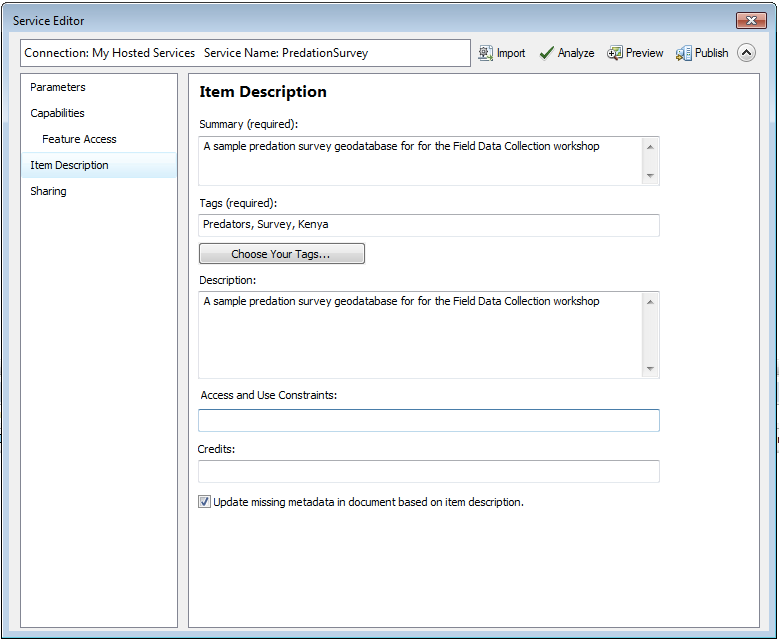

13. On the Service Editor toolbar, click Publish.

You should see various status messages as the service publishes, and a final success message when complete

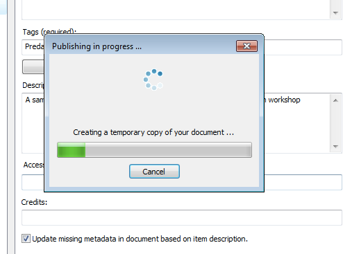

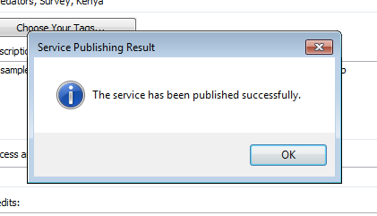

Click OK on the result message.

Minimize ArcMap or exit the ArcMap application. Save your changes if prompted.
Now that you've created your data model and published it to ArcGIS.com, we are ready to shift to the online platform to create the map that will power our Collector app and data collection activities.

# Creating a Map to Share for Data Collection
[http://doc.arcgis.com/en/collector/android/create-maps/create-and-share-a-collector-map.htm](http://doc.arcgis.com/en/collector/android/create-maps/create-and-share-a-collector-map.htm)

