#Creating the ArcGIS.com Map for Your Collector App.

In this part of the workshop, you'll create a map to use to collect data about Large Animal Predation. You'll build a map by starting with a basemap, adding the PredationEvents layer (that you published in the previous exercise), configuring the data collection form, and customizing the application settings. Finally, you'll share the map to make it available to your surveyors.

##Create a map

In the following sections, you'll create a map by starting with a basemap, adding the PredationEvent layer, and exploring the details exposed for the assessments.

###Start a new map

1. Open a web browser and sign into your ArcGIS.com Organization account.

2. Click **Map** on the menu at the top of the page, above the banner.

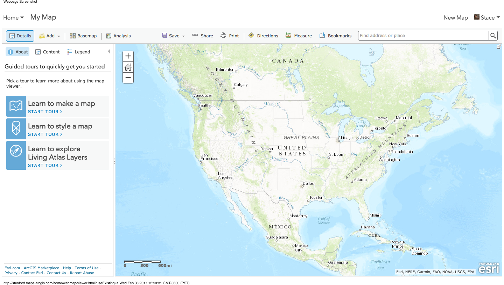

3. Pan and zoom the map so that Kenyatta University is visible if it isn't already.

###Adding Your PredatorSurvey Template Layer

4. Click the **Add** Button on the ribbon and choose **Search for Layers**.

5. Set the **In** drop-down list to **My Content** and search for '**Predator**' in the **Find** text box.

6. You should see the layer you published earlier, as the search result.

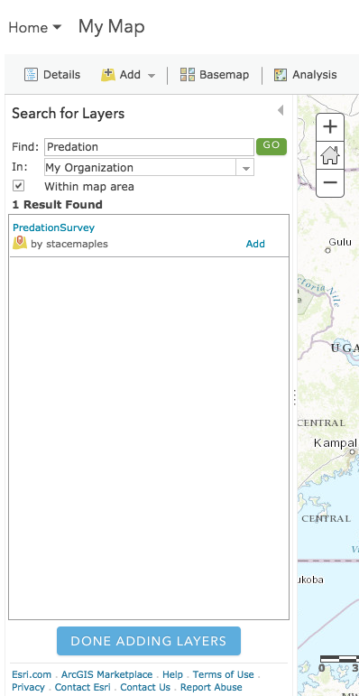

7. Click **Add** on the **PredationSurvey** layer to add the result to your map.

8. Click **Done Adding Layers** at the bottom of the side panel and the **Search for Layers** side panel closes, and the Contents side panel appears.

Note:
You are using the **PredationSurvey** layer you published, and it has no data. That is okay and you will add some data later in this section.

In order to have something to focus and test functionality on, let's add a few points

1. Click Edit on the ribbon.
2. In the Search box at the top right of the map, search for "Kenyatta University" and click on the search button to pan to the campus. 
2. The PredationSurvey feature types appear in the side panel, showing the symbols that represent the different values of predators in the template.
3. Select the editing template for 'Lion' and place a feature into the map.
4. Use the dropdowns in the popup to provide values for all of the fields and note that your domains are driving the content!
5. For the image, you can browse to the data folder for the excercise and the image in that folder

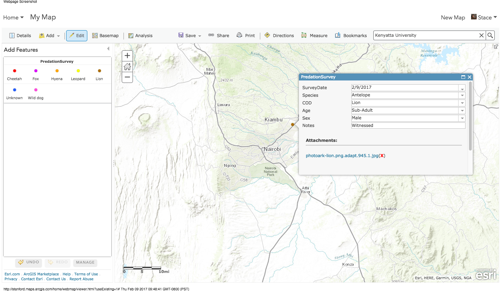

A new feature will be added to the map. You can repeat the above steps to add more data to your feature layer. Don't worry about using an image for every feature.

1. WHen you're done adding features, click on the Edit button to close your editing session.

###Save the map

1. Click Save Save on the ribbon and choose Save. The Save Map dialog box appears.
2. Complete the fields on the Save Map dialog box as shown or as appropriate.
The Save Map dialog box with all fields completed
3. Click Save Map.

###Test the Pop-Up

1. Zoom in on the map to explore the Predation Events you created.
2. Click one of the existing Predator Events. Information about the damage assessment displays. 

This information is available to anyone viewing the map. It also determines the information that can be collected while in the field. The same information shows in the pop-up here and in the app. The fields you see depend on the PredationSurvey layer you added to the map. 

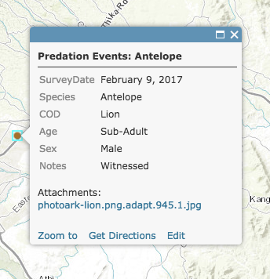

3. Close the pop-up.

You have now made a map by adding a basemap and some layers, and you explored its pop-ups. Much of the value of this map lies in the information contained in its pop-ups. In the next section, you'll see how to configure pop-ups to display the information you want to share.

##Configure the Data Collection Form

In the previous section, you made a map by adding a layer and explored the details exposed in the pop-ups. You can customize the information the pop-ups display, as well as the information collected in the field.

1. Click **Contents** to display the Map Contents panel.
2. On the side panel, hover over the PredationSurvey layer and click the small ellipsis to the right of the tools.
4. Choose **Configure Pop-up** in the layer properties context menu. The side panel changes to allow configuration of the pop-up.

The default pop-up title consists of the layer name (Predation Events) plus a field name in curly brackets. The fields come from the data in the layer on your map. In this case, the field name is **Species** in the shared map, or **species** in the data you published. This field displays the type of prey that was recorded. Field names work like variables, so when you click a Predation Event on the map, its pop-up title shows the prey species for that particular record.

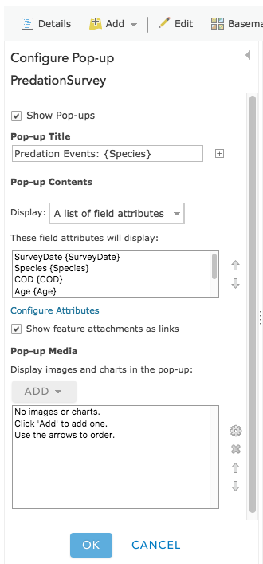

1. In the **Pop-up Contents** section, click **Configure Attributes** (Under the list of attributes that will display). 

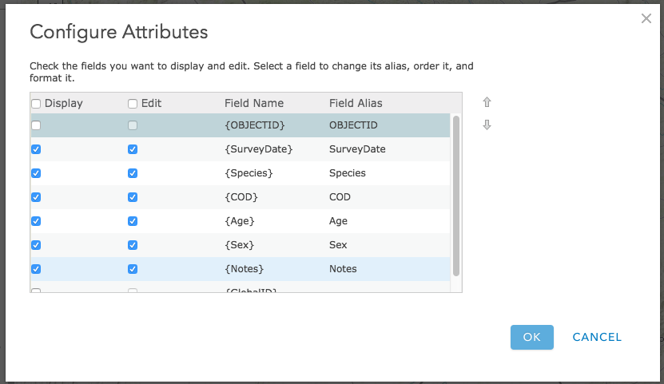

The Configure Attributes dialog box lists the features' fields by their display state (on or off), field name (which can't be changed), and field alias (which can be changed).

2. In our case, we want to make some of the field names more user friendly, so we will edit the Aliases of each of fields, as below:

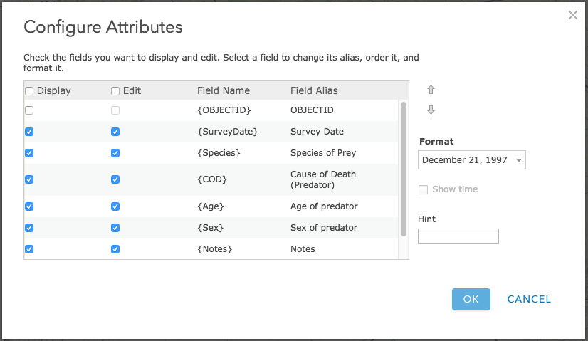
 
3. Click OK to close the Configure Attributes dialog box.
4. Click OK at the bottom of the Configure Pop-up panel.
5. Click a Predation Event on the map to see its updated pop-up.

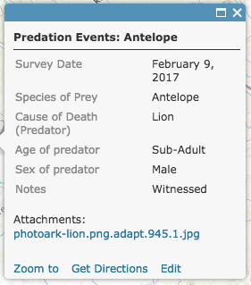

Note that the field names in the pop-up are more informative and user friendly. The changes you ahve made here, will be reflected in the COllector app, as well.

1. Close the pop-up on the map.
2. Click Save on the ribbon and choose Save.
3. 
Your map is now ready to use for data collection. In the next section, you'll see how to customize the capabilities available when the map is used in Collector.

##Customize the application settings

Some of the capabilities of maps can be turned on and off. These settings include the ability to route, measure, change basemaps, find locations, and track the location of collectors. By default, the routing, measuring, switching basemaps, and finding locations by address capabilities are enabled. In this section, you'll turn off the routing and measure capabilities and turn on the find locations by layer (feature search) capability, since your field-workers need to search features but don't need to get routes or measure when collecting data.

1. Click **About** on the side panel to display the map's details.
2. Click More Details to go to the map's item details page.
3. Click the Settings tab.
4. Uncheck the Routing, Measure Tool and FInd Locations check boxes under Application Settings in the Web Map Settings section.
5. Click Save to save your application settings.

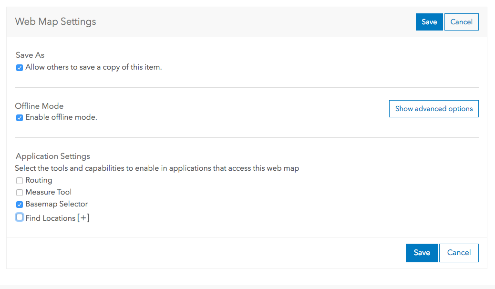

Your map is created, configured, and customized. It's ready to be shared with others in your organization.

###Share your map

Now that your map is ready for use, share it with members of your organization.

1. On the item details page, click the Overview tab and click Share.

On the Share dialog box, note the options for sharing publicly, within your organization and with Groups. In a real survey, you would probably want to establish an ArcGIS Grouop, share the map with it, and add your surveyors to that group). 

2. Since you are the only person who will use this app, you don't need to share it out. Click cancel to dismiss the Share Dialog, and 

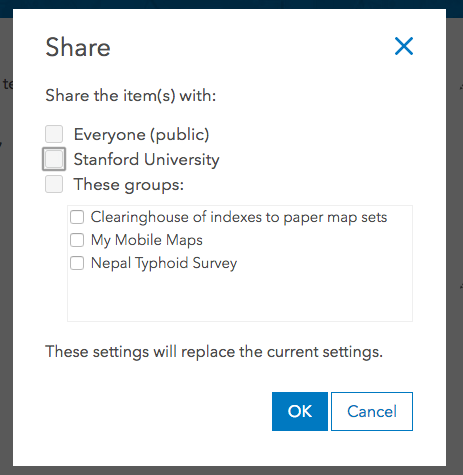

Note:
Your sharing options depend on the organizations and groups to which you belong. You won't see the same options shown in the previous screen capture.
If your layer needs to be shared, you're prompted to update its sharing to match that of your map. Share the layer so those who can access the map can see the data.

##Sign in to the app to see your map

Your map is now ready to use in Collector. Log in to the app to see how the map looks to your field-workers.

1. Start Collector on your Android device.

> Note:
> Install Collector for ArcGIS from Google Play or the App Store if you don't have it on your phone.

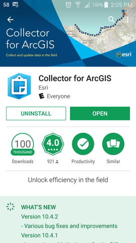

2. Sign in if you haven't already done so.

3. Type the URL for your organization and click Continue.

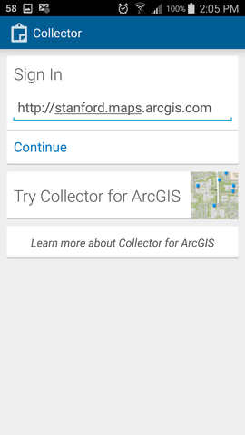

4. Provide the requested information to sign in.

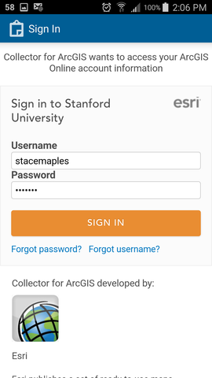

5. If your map is not immediately apparent, find your new map by searching for Predator on the **All Maps** page.

##Downloading a Basemap for Offline Collection

In order to be able to collect data offline with a basemap for reference, we will first download a basemap.  

6. Touch the **Download** Link on the **Predation Survey** map card to open the map.

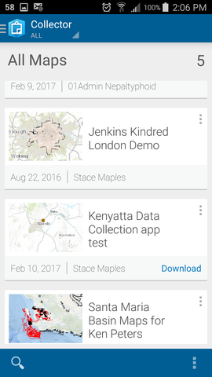

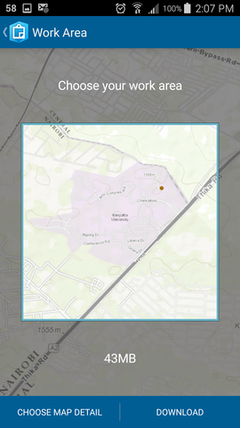

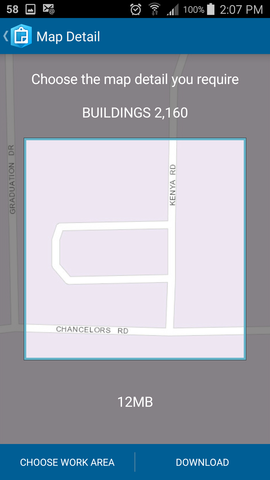

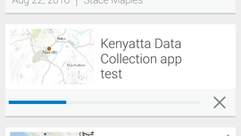

##Collecting Data with Your App

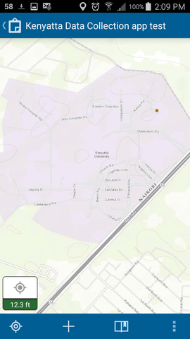

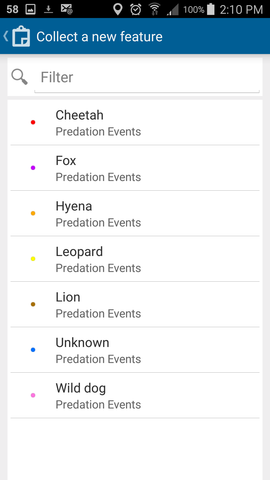

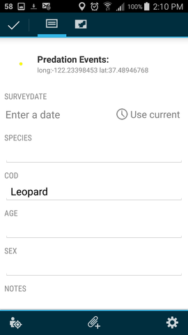

Select a feature to see information about it
To show the actions you can take with the feature, select the arrow to the right of the feature information Feature Action.
Menu of actions available for the selected feature
Select Show details to see the pop-up you configured.
On the device, view the pop-up you configured as part of your map
You have created, configured, customized, and shared a map for data collection. Your map is now ready to use in Collector and is available to all the members of your organization. Now you are ready to collect data on this map.